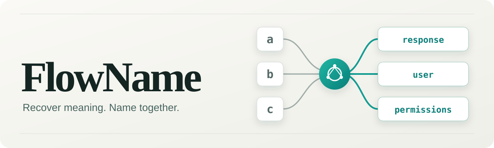
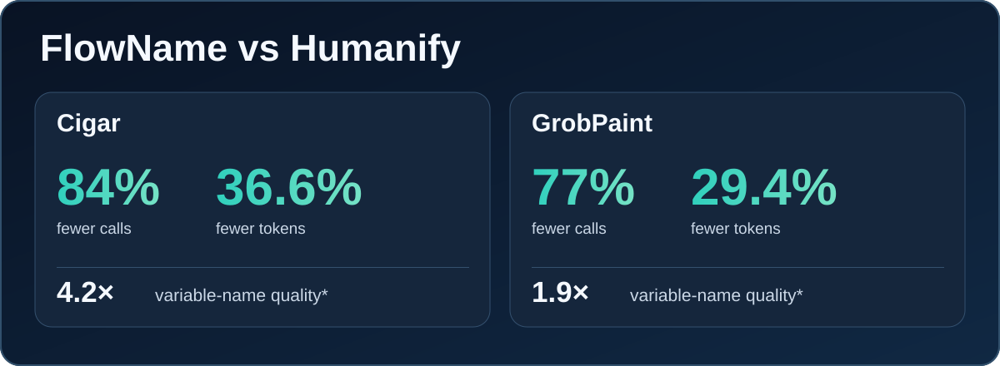

# FlowName





*Name quality shows the ratio of names exclusively preferred by an automated, uncalibrated Jev evaluation. [See the exact counts, method and limitations →](https://123wwwa.github.io/FlowName/benchmarks/)*

**[Try FlowName in your browser →](https://123wwwa.github.io/FlowName/)** — enter your JavaScript, API key and model; no installation required.

**CLI:** `npx --yes --package=flowname@latest flowname input.js` (set `GEMINI_API_KEY` first).

**FlowName** is a next-generation Semantic Identifier Recoverer for obfuscated JavaScript. By using AST-based static analysis to group logically related variables into budgeted LLM requests, FlowName eliminates the context-loss hallucinations common in naive text-window approaches.

Across two direct benchmarks against a leading symbol-based tool (Humanify) on Cigar and GrobPaint, FlowName delivered these average relative results:

* ⚡ **82% Faster Execution** through relation-guided request batching .
* 💰 **33% Lower Token Cost**  by eliminating overlapping context bloat.
* 🎯 **Higher Semantic Precision** and 85% more exact original-name matches, proving that guaranteed AST context prevents LLM hallucinations.

In a second comparison on GrobPaint's 1,786 anonymized bindings, FlowName used 408 vs 1,786 API calls and 29.36% fewer total tokens; original-source-aware Jev gave 512 vs 274 exclusive preferences.

**[Explore the benchmark summary and both searchable name reports](https://123wwwa.github.io/FlowName/benchmarks/).** Jev's judgments are automated and uncalibrated. Humanify's prompt omitted the target spelling for some bindings, and collision-safe suffixes can affect applied-name scores. See the summary for the context split and limitations.

## Run it

Set `GEMINI_API_KEY` (or `FLOWNAME_API_KEY`) in your environment, then run:

```sh
npx --yes --package=flowname@latest flowname input.js
```

The CLI writes recovered code to a new `flowname-output-TIMESTAMP-ID/output.js` directory. Add `--report` to watch each request and proposed name in a live HTML report. No flags are required for the default Gemini model; the CLI does not load `.env` automatically. Requires Node.js 22.8+.

For the browser, open the [playground](https://123wwwa.github.io/FlowName/), paste JavaScript, supply your own API key and start recovery. Requests go directly from your browser to the selected provider; **Stop** interrupts the run.

## Where it fits

FlowName names identifiers; it does not unpack bundles or undo structural obfuscation. Use [webcrack](https://github.com/j4k0xb/webcrack) for supported obfuscation patterns or [Wakaru](https://github.com/pionxzh/wakaru) for supported bundles, then pass the resulting JavaScript to FlowName. It resolves lexical bindings, uses lightweight relations and same-scope fallback to group targets, and asks the LLM for several names per request. [See how the grouping works](docs/relation-walkthrough.md).

## Use it as a library

```sh
npm install flowname
```

```js
import { readFile } from 'node:fs/promises';
import { recoverNames, createProvider } from 'flowname';

const sourceCode = await readFile('./input.js', 'utf8');
const provider = createProvider({
  provider: 'gemini',
  model: 'gemini-3.5-flash-lite',
  apiKey: process.env.GEMINI_API_KEY,
});
const result = await recoverNames(sourceCode, { provider });
console.log(result.code);
```

See the [usage guide](docs/guide.md) for options, CLI reports and a complete library example. The [documentation index](docs/README.md) covers the approach, architecture, limitations, prior work and [Humanify comparison](docs/humanify.md).

Licensed under [MIT](LICENSE). See the [release notes](CHANGELOG.md).
