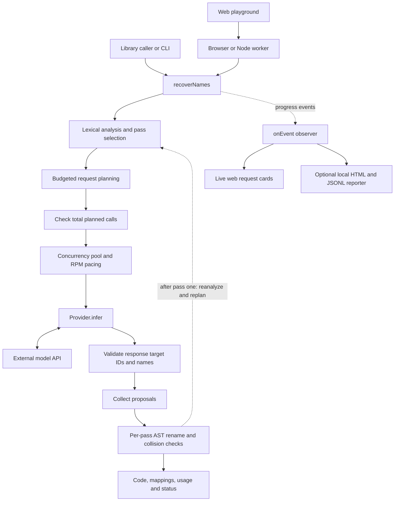
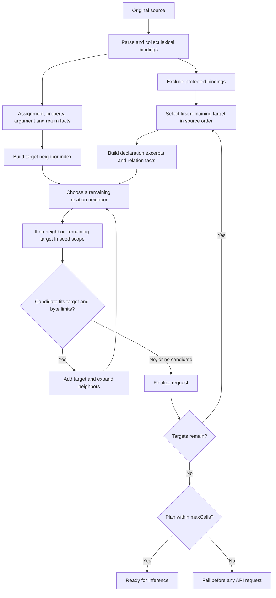
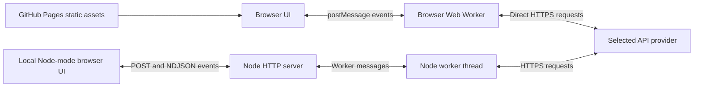

# Architecture

[Back to README](../README.md) · [Usage and deployment](guide.md)

This document describes the current product implementation. The README explains the motivation and preliminary experiments; the diagrams below show how the shipped library and playground actually work. GitHub renders the Mermaid diagrams directly.

For a concrete input and its actual binding IDs, graph facts and request groups, see the [relation walkthrough](relation-walkthrough.md).

## System overview



`recoverNames` coordinates the pipeline. A provider is the network boundary; reporting is an optional event observer. The core does not write files or execute the submitted JavaScript. The initial plans are checked before inference. When `passes: 2` is selected and both priority and remaining targets exist, the core applies pass-one names, reanalyzes the rewritten source and rebuilds pass two. Requests within a pass share one source snapshot. See [two-pass recovery](recovery-passes.md) for the boundary and partial-response policy.

## Module responsibilities

| Module | Responsibility |
| --- | --- |
| [`src/passes.ts`](../src/passes.ts) | Priority target selection and verified ID rebasing after rename |
| [`src/library.ts`](../src/library.ts) | Public API, plan gate, scheduling, event emission, failure policy and final result |
| [`src/lightweight.ts`](../src/lightweight.ts) | Eligible bindings, source positions, reference locations and lexical relation facts |
| [`src/request-budget.ts`](../src/request-budget.ts) | Relation-first grouping, same-scope fallback and bounded request construction |
| [`src/grouping.ts`](../src/grouping.ts) | `promptFor`: render an inference request as model instructions and context |
| [`src/inference.ts`](../src/inference.ts) | Compatible HTTP provider, request body, response-size limits, JSON and ID validation |
| [`src/provider-config.ts`](../src/provider-config.ts) | Node-side provider configuration and environment defaults |
| [`src/concurrency.ts`](../src/concurrency.ts) | Concurrent task pool and serialized work helper |
| [`src/rename.ts`](../src/rename.ts) | Source identity check, binding-aware application, collision adjustments and syntax reparse |
| [`src/html-reporter.ts`](../src/html-reporter.ts) | Optional Node filesystem observer: HTML, JSONL, output code and result JSON |
| [`src/product-cli.ts`](../src/product-cli.ts) | CLI input, options, provider, reporter and cancellation wiring |
| [`web/options.js`](../web/options.js) | Shared web defaults and option validation |
| [`web/app.js`](../web/app.js) | Form, request cards, suggestions, final names and download |

The product calls `lightweight` and `budgetedRequests`. Research grouping helpers remain in some shared source files but are not selected by `recoverNames`. `analysis.ts` supplies parser utilities; the product does not invoke its full analysis pipeline.

## Analysis and request planning



Bindings have source-position IDs such as `s123`, a lexical scope, a declaration span and reference locations. The source hash associates the analysis with the exact input. Imports and detected exported bindings are protected. Detected direct unbound `eval` or `with` disables all renaming for the file.

Relations are lightweight syntactic evidence, not a complete def-use engine:

- Assignments connect a simple identifier target to referenced bindings in its initializer or right-hand side.
- Property accesses record object/property facts; a self-edge describes a property without connecting two targets.
- Calls connect referenced participants in the callee and arguments; they do not resolve the called function or match arguments to parameters.
- Returns connect a named function declaration to referenced bindings in its return expression.

There is no CFG, reaching-definition analysis, alias resolution or interprocedural call graph. The request's `definitions` and `defUses` fields are empty in this path.

The planner greedily grows each group through relation neighbors, then remaining bindings in the seed's scope. A failed fit ends that group; it does not search all alternative subsets. Each eligible target appears in one planned request. A group may still contain a single target. A singleton that cannot fit causes planning to fail before networking.

Context consists of merged declaration excerpts: approximately 50 source units before each declaration and at least 110 from its start, extended to include its name. It does not expand every reference location or send whole functions by default. Up to 64 in-group relation facts are retained, subject to the prompt budget. The byte measurement covers `promptFor(request)` in UTF-8, not the HTTP envelope or tokenizer overhead. Metadata records omitted facts and unexpanded reference counts. The provider output allowance is `128 + 64 × target count` tokens.

## Request lifecycle and final application

```mermaid
sequenceDiagram
    participant Host as Caller or worker
    participant Core as recoverNames
    participant Observer as onEvent
    participant Provider as Provider
    participant API as Model API
    participant Rename as AST renamer
    Host->>Core: Source, provider and options
    Core->>Core: Analyze, select passes, preflight maxCalls
    loop Each pass (at most two)
    Core->>Observer: plan(total)
    loop Each scheduled request, with bounded overlap
        Core->>Core: Wait for RPM start slot
        Core->>Observer: request(index, context, targets)
        Core->>Provider: infer(request)
        Provider->>API: Prompt and output constraints
        API-->>Provider: Response and optional usage
        Provider-->>Core: Names or error
        Core->>Core: Accept valid entries; repair unresolved IDs at most once
        Core->>Observer: response(index, names or error, usage)
    end
    Core->>Rename: Current pass source, analysis and retained proposals
    Rename-->>Core: Code, accepted, rejected and adjusted names
    Core->>Observer: pass-complete(applied names)
    Core->>Core: Reanalyze and replan if another pass remains
    end
    Core->>Observer: complete(result)
    Core-->>Host: RecoveryResult
```

Concurrency limits in-flight calls; RPM spaces their start times. Responses may arrive out of order. Parseable answers retain valid target entries independently. Unknown IDs are ignored; unresolved IDs alone may receive one corrective attempt. Invalid JSON is not salvaged. Both attempts use the same pool and RPM budget. Names propagate only across the first-pass application boundary, not between requests in a pass. Valid identifier spelling and binding safety are checked during final renaming.

The renamer reparses the current pass source and checks its hash. It resolves collisions in source order, allowing reuse in independent scopes and conservatively protecting ancestor/descendant bindings and unresolved references. Numeric suffixes handle collisions. Temporary names permit swaps before final names are applied. Generated output is parsed again for syntax validity; this is not a behavioral-equivalence test.

Request-card suggestions are provisional. Each pass applies accepted proposals with collision checks; pass-complete exposes applied names before the next pass. The complete result combines both passes. Original author names and semantic quality scores are not part of the product API.

## Deployment boundaries



| Mode | Execution and transport | Key and source handling |
| --- | --- | --- |
| GitHub Pages | [`browser-transport.js`](../web/browser-transport.js) starts [`browser-worker.js`](../web/browser-worker.js); worker bundles the shared core and calls the provider directly | Input lives in the browser; selected prompt context and key go to the provider. No FlowName backend or browser-storage persistence |
| Local Node server | [`transport.js`](../web/transport.js) posts to [`server.mjs`](../web/server.mjs); [`worker.mjs`](../web/worker.mjs) runs the core; events return as NDJSON | Full submitted source and key pass through the local server to its worker; no application file/database persistence |
| Library or CLI | Runs in the caller's Node process with the chosen provider | Caller controls input, credentials and persistence; the optional HTML reporter writes source context and results |

Both web modes use an allowlist of Gemini, OpenAI and Groq endpoints. Pages access depends on provider CORS. The browser build substitutes its transport and provides Buffer and SHA-256 adapters; it does not load the Node HTTP server or filesystem reporter.

[`build-pages.mjs`](../scripts/build-pages.mjs) produces `pages-dist`. [GitHub Actions](../.github/workflows/pages.yml) runs offline tests and publishes that directory on `main`; pull requests only validate. Model keys are not required for building or deploying. The Node library package is built separately and is not published by this workflow.

## Defaults, limits and cancellation

| Option | Library default | Web default | Web accepted range |
| --- | ---: | ---: | ---: |
| `passes` | 1 | 1 | 1 or 2 |
| `concurrency` | 4 | 16 | 1–32 |
| `rpm` | 60 | 60 | 1–6,000 |
| `maxCalls` | 10,000 | 1,000 | 1–10,000 |
| `promptBytes` | 12,000 | 12,000 | 1,024–1,048,576 |
| `maxTargets` | 16 | 16 | 1–64 |

Library and web defaults intentionally differ. Web validation runs at the worker boundary and, in Node mode, at the server boundary. Fields are locked while a run is active.

| Condition | Current behavior |
| --- | --- |
| Analysis or planning failure | Reject before inference; no automatic splitting into separate file runs |
| HTTP 401, 403 or 429; three consecutive attempts without usable names in completion order | Stop new scheduling, drain already-started calls, finalize available proposals |
| Model-content JSON or target-ID failure | Retain valid entries; at most one corrective retry for unresolved IDs within spare budgets; log both attempts and usage |
| Other request failure | Emit error and continue unless the consecutive-failure threshold is reached; no automatic retry |
| Missing token usage | Aggregate token counts become `null`, rather than counting unknown usage as zero |
| Library AbortSignal / CLI Ctrl+C | Stop scheduling and drain in-flight calls; return a cancelled result if finalization succeeds |
| Web Stop / session timeout | Terminate worker and connections; received cards remain, but no final collision-checked output is guaranteed |
| Observer failure | Reject the run and stop new scheduling; a complete result is not guaranteed |

Analysis accepts up to 8 MiB of source and caps relation accumulation at 100,000. Its 30-second check is cooperative, not a hard parser timeout. Web input is limited to 512 KiB and a session to 20 minutes. Node web hosting allows two sessions per process with a 256 MiB worker old-generation limit; a browser worker has no equivalent configured memory quota. Web provider calls use a 30-second timeout and a 1 MiB response-body limit. Already-submitted requests may incur charges after cancellation.

## Observability

The core emits `plan`, `request`, `response`, `pass-complete` and `complete`. Plan totals can change at the pass boundary; pass/group/attempt fields identify execution context. Web transports can additionally report `fatal`. These are execution events, not full HTTP transcripts: credentials are excluded, and the public response event contains parsed names/errors and usage rather than the entire raw provider response.

The optional HTML reporter serializes writes to `events.jsonl` and replaces `index.html` through a temporary file. It refreshes every two seconds until completion, then links `output.js` and `result.json`. Browser cards consume the same core events in memory and offer a final JavaScript download; they do not use that filesystem reporter.
