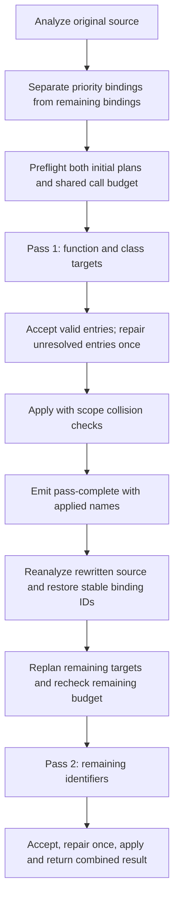

# Partial acceptance and two-pass recovery

[Back to README](../README.md) · [Architecture](architecture.md)

The default is a single combined pass. Opt into a maximum of two passes using the web **Recovery mode** selector, CLI `--passes 2`, or API `passes: 2`. `--passes 1` / `passes: 1` explicitly selects the default. Other values are rejected before inference. The two-pass sections below apply only when that mode is selected; partial acceptance works in both modes.

## Per-target acceptance

The compatible provider parses the response JSON once. `acceptResponse` in [inference.ts](../src/inference.ts) examines the `names` object per requested ID:

| Entry | Action |
| --- | --- |
| Requested ID with a valid JavaScript identifier, at most 256 string units, excluding `arguments`, `eval`, `await`, `yield` | Retain the proposal |
| Missing requested ID, wrong value type or invalid identifier | Mark that ID unresolved |
| Unknown ID | Ignore and record in `ignoredIds`; do not discard valid entries |
| Invalid JSON or missing/non-object `names` | No fragment extraction; every target in that attempt is unresolved |

Returning the current name is valid. These checks establish format and spelling, not semantic accuracy. Scope collision checks still run when the pass is applied. Custom providers go through the same acceptance logic in `recoverNames`.

For an initial request targeting `s1, s2, s3`, a response containing a valid `s1`, invalid `s2` and no `s3` retains `s1`. The one allowed corrective attempt targets only `s2, s3`. Its relations are filtered to those endpoints; its source context remains unchanged. It appends the fixed format instruction without including the malformed response. If a repair tries to rename `s1`, that entry is now an unknown ID and is ignored. If the repair also fails, the first accepted value remains available for application.

`response.names` contains retained proposals, `unresolved` maps rejected/missing IDs to reasons, and `ignoredIds` identifies unwanted keys. JSONL and HTML retain both attempts. `failedCalls` includes partially unsuccessful attempts even when all IDs are eventually recovered. Unknown usage from any actual invocation makes aggregate usage unknown.

## Pass selection and application

[passes.ts](../src/passes.ts) selects eligible bindings marked `namingRole` by the lexical analyzer: function/class declarations, named function/class expression bindings, and variables initialized directly with functions, arrows or class expressions. Imports and other protected bindings remain excluded. Global scalar variables are not automatically priority targets.

Priority targets are ordered by program-scope membership, then descending reference count, then declaration position. This is a deterministic seed order for relation grouping, not a learned confidence measure or a guarantee that every global is sent before every nested binding. If priority or remaining targets are empty, the run uses one pass.

At the first boundary, only valid proposals are applied through `rename`. Numeric collision suffixes are part of the propagated name. The next pass reanalyzes this actual output, recomputes offsets/scopes/relations, and restores original IDs by declaration order. The rebase verifies binding count, expected names, kinds and naming roles; a mismatch prevents pass two and produces a warning. This is a rename-only invariant, not a mapping strategy for arbitrary source transformations.

Example: `function f(a){return a+1;}` first targets `f`. If `f` becomes `increment`, the second pass receives source containing `function increment(a)` and targets only `a`. The parameter keeps its original ID even though its current declaration offset moved. First-pass bindings are not proposed again in pass two; local collisions are adjusted around those applied names. Combined result mappings continue to use original IDs.

The LLM is explicitly told that existing source names may be previous suggestions and are not verified semantics. Prompts still use bounded declaration excerpts: the applied name may not appear in every distant excerpt. There is no global name dictionary injected into every request, no cross-request propagation within a pass, and no third pass. Earlier failures are not silently requeued as second-pass targets.

## Shared budgets and stopping

`maxCalls`, RPM, concurrency, usage and the no-progress failure streak span the whole run. Both original target sets are planned before the first network call; an initial plan larger than `maxCalls` fails immediately. Repairs may use only spare call slots after reserving pending initial requests and the original estimate for pass two.

Renaming can change prompt sizes and grouping. Before pass two, its actual plan is rebuilt. If it exceeds the remaining calls or cannot fit a prompt, pass-one code and mappings are retained, status is `partial`, and a warning explains why pass two did not run. Initial reservation is therefore not a promise that the revised second pass will fit.

Three consecutive attempts with no usable names stop scheduling. Partial progress resets that streak. HTTP 401/403/429 also stop new work; network, HTTP-envelope, size-limit and other transport errors are not retried. Already started work drains in the library. Each group has at most two attempts, independently of the pass number. Cancellation between passes preserves completed first-pass application and starts no second-pass calls. Web Stop instead terminates its worker immediately, so a final downloadable result is not guaranteed.

`plan` is emitted for each executing pass and its `total` reflects the latest aggregate plan plus scheduled repairs. `request` and `response` carry a globally unique attempt `index`, a `groupIndex`, `pass` and `attempt`. `pass-complete` exposes collision-checked `applied` names before the next pass. `complete` returns the combined result. Planned totals may change; `calls` counts provider invocations and `plannedCalls` counts the latest initial-group plans, excluding repairs.

## Remaining limits

Two-pass propagation can amplify an incorrect early interpretation. It does not validate semantic naming quality, guarantee behavior equivalence, or replace missing source evidence. The partial-acceptance policy does not repair arbitrary broken JSON by guessing fragments. Dynamic analysis and execution of untrusted input remain outside the implementation.
