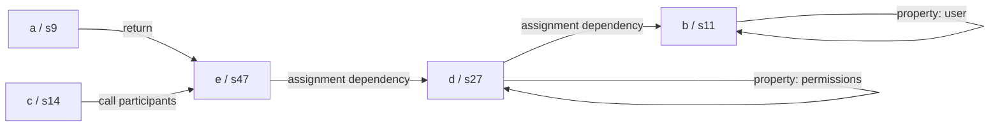

# From source code to a joint naming request

[Back to README](../README.md) · [Architecture](architecture.md)

This example isolates the `lightweight` → `budgetedRequests` → `promptFor` → `rename` building blocks by passing all eligible IDs directly to the planner. The public `recoverNames` API uses a combined single pass by default and separates priority and remaining targets only with `passes: 2`; see [the actual orchestration policy](recovery-passes.md). The one-group and split-group examples below describe a direct planner invocation, not an opted-in two-pass call sequence. Binding IDs, relations, group order and prompt size below were checked by running the local implementation without an API call. The short snippet illustrates mechanics; it is not benchmark data or evidence of naming quality.

## 1. Input and runtime meaning

```js
function a(b, c) {
  const d = b.user;
  const e = d.permissions;
  c(e);
  return e;
}
```

At runtime, `d` receives `b.user`, `e` receives `d.permissions`, and `e` is passed to `c` and returned. This is a reading of the source, not a runtime trace computed by FlowName. The code does not establish that `b` is an HTTP response, that `permissions` is an array, or what callback `c` does.

## 2. Resolve occurrences to bindings

[`lightweight.ts`](../src/lightweight.ts) uses Babel lexical bindings rather than a map keyed only by name. With the exact snippet above, LF newlines and no trailing newline:

| Name | Target ID | Declaration offset | Binding scope | Reference offsets |
| --- | --- | ---: | --- | --- |
| `a` | `s9` | 9 | `Program:0` | None |
| `b` | `s11` | 11 | `FunctionDeclaration:0` | 31 |
| `c` | `s14` | 14 | `FunctionDeclaration:0` | 68 |
| `d` | `s27` | 27 | `FunctionDeclaration:0` | 51 |
| `e` | `s47` | 47 | `FunctionDeclaration:0` | 70, 83 |

Offsets are UTF-16 source positions, starting at zero. IDs are stable for this input, not across edits. The function declaration's name belongs to the enclosing program scope; its parameters and local declarations belong to the function scope. A different function's `b` would have its own binding and ID. Static property keys `user` and `permissions` are evidence, not lexical rename targets.

Reference locations associate occurrences with their bindings. They do not automatically become graph edges or cause a source window to be added around every use.

## 3. Extract syntactic evidence

| Source construct | Stored relation | Meaning of the recorded evidence |
| --- | --- | --- |
| `const d = b.user` | `s27 → s11`, `assignment` | The initializer for `d` references `b` |
| `b.user` | `s11 → s11`, `property: user` | `b` participates in access to property `user` |
| `const e = d.permissions` | `s47 → s27`, `assignment` | The initializer for `e` references `d` |
| `d.permissions` | `s27 → s27`, `property: permissions` | `d` participates in access to property `permissions` |
| `c(e)` | `s14 → s47`, `argument` | `c` and `e` are referenced participants of the same call |
| `return e` inside declaration `a` | `s9 → s47`, `return` | Function declaration `a` returns an expression referencing `e` |

Each fact also retains the source span of its construct. Assignment edges point from the assigned binding toward its dependencies, which is the reverse of a conventional value-flow arrow. The planner treats connections between distinct targets as **undirected** for grouping.



Self-property facts enrich the prompt but do not connect distinct targets. An `argument` edge is co-participation, not proof of which function `c` resolves to or how its parameter is used. The return extractor handles named function declarations; it is not a general interprocedural return analysis.

## 4. Build a group and its context

With `maxTargets: 16` and `promptBytes: 12000`, the planner starts at the first eligible declaration, `a`, and produces this target order:

```text
a → e → d → c → b
s9, s47, s27, s14, s11
```

`a` connects to `e`; `e` exposes `d` and `c`; `d` exposes `b`. All five fit into one request. Relation neighbors may cross lexical scopes, as `a` does here. Same-scope restriction applies to the fallback selection, not every relation edge.

The planner first takes declaration-centered excerpts, merges overlapping ranges, and retains only facts whose two endpoints are in the group. The default usage mode then adds selected use sites within spare budget; the declarations-only baseline skips this step. This input is only 87 source units long, so the merged context happens to include the entire snippet. That does not mean the planner sends entire files or functions on larger inputs.

Observed request metadata:

| Field | Value |
| --- | --- |
| Group kind | `relation` |
| Target count | 5 |
| Source excerpt | `[0,87)` |
| Relation facts | 6 |
| Rendered prompt bytes | Compute with the reproduction script; the prompt template can change |
| Omitted relation facts | 0 |
| Reference locations not explicitly expanded | 5 |
| Output-token allowance | 448 (`128 + 64 × 5`) |

The five reference locations happen to be visible because the snippet is short; they did not independently drive context expansion. Byte counts depend on the current prompt template and are not token counts.

## 5. Send the naming request

[`promptFor`](../src/grouping.ts) supplies instructions to rename only target IDs, retain unclear names and return every target exactly once. It serializes these fields:

| Field | Contents in this example |
| --- | --- |
| `targets` | Five compact records: ID, current name and `at` (declaration start offset) |
| `context` | The merged source excerpt with its offset marker |
| `relations` | The six facts above with `from`, `to`, `kind` and optional property labels; spans are omitted |
| `defUses` / `definitions` | Omitted in compact mode; no reaching-definition results are computed |

The default is `promptFormat: compact`. The `verbose` option keeps the previous full target records, relation spans and empty analysis arrays. Internal bindings and relation graphs retain their full metadata in both modes. `at` is an explicit position in the current pass source, not a position inferred from the ID; IDs remain stable when pass-two source positions change.

Grouping and budgeting metadata are available to the host/logs but are not serialized by `promptFor`. [`requestBody`](../src/inference.ts) sends the rendered prompt as one user message through the compatible chat-completions API, with the selected model, temperature 0, JSON-object response format and the output allowance. Target IDs, rather than name spellings alone, identify which bindings the response addresses.

The following is an **illustrative response**, not an actual model result:

```json
{
  "names": {
    "s9": "notifyAndGetPermissions",
    "s47": "permissions",
    "s27": "user",
    "s14": "onPermissions",
    "s11": "container"
  }
}
```

The graph does not generate these words. It selects targets and supplies evidence so the model can propose names together. Valid response entries are retained per target. Unknown IDs are ignored; missing or invalid entries alone may receive one corrective retry. A failed repair preserves previously retained names. At each pass boundary, the renamer checks scope collisions and applies retained proposals to that pass source. Assuming the illustrative names are accepted, the result is:

```js
function notifyAndGetPermissions(container, onPermissions) {
  const user = container.user;
  const permissions = user.permissions;
  onPermissions(permissions);
  return permissions;
}
```

## 6. What happens when the group must split?

For the same input and byte budget, changing `maxTargets` to 3 produces:

| Request | Targets in order | Group kind | Retained facts |
| --- | --- | --- | --- |
| 1 | `a, e, d` | `relation` | `a → e`, `e → d`, `d → d: permissions` |
| 2 | `b, c` | `scope-fallback` | `b → b: user` |

After request 1 claims `e` and `d`, their neighbors `b` and `c` remain. They have no direct edge to each other, but share a lexical scope, so the fallback groups them. This is a packing decision, not evidence that they have a direct value dependency.

Cross-request facts `d → b` and `c → e` are absent from the transmitted relation lists. The source excerpts may still show those expressions, especially in a short example. Within a single planner invocation, requests have distinct initial target sets and share the same source snapshot. With `passes: 2`, the public API propagates applied priority names into its second pass; corrective attempts may repeat only unresolved IDs. This is where group limits can discard useful structured context.

## 7. Limits of the data-flow interpretation

For `let x = first(); if (flag) x = second(); consume(x);`, FlowName may record lexical relations for the assignments and call participants. It does not determine which assignment reaches `consume` on a given path. Likewise, object aliases, computed property values and dynamic call targets are not resolved. A long-distance reference may be recorded without its surrounding code being sent.

The precise mechanism is therefore **binding resolution → syntactic relation extraction → budgeted target grouping → joint model naming → binding-aware application**. It reduces repeated requests when multiple targets fit together, but relation edges are evidence rather than a complete model of runtime data flow.

## Reproduce the analysis without an API

After `npm run build`, run this as a Node ES module from the project root:

```js
import { lightweight } from './dist/lightweight.js';
import { budgetedRequests } from './dist/request-budget.js';
import { promptFor } from './dist/grouping.js';

const source = [
  'function a(b, c) {',
  '  const d = b.user;',
  '  const e = d.permissions;',
  '  c(e);',
  '  return e;',
  '}',
].join('\n');
const analysis = lightweight(source);
const ids = analysis.symbols.filter(s => s.eligible).map(s => s.id);
const requests = budgetedRequests(source, analysis, ids, 12000, 16);
console.log(JSON.stringify({ analysis, requests }, null, 2));
console.log(promptFor(requests[0]));
```

These imports are internal build modules for inspecting the implementation, not additional public package exports. This only analyzes and prints the request; it neither calls a provider nor executes the submitted source.
